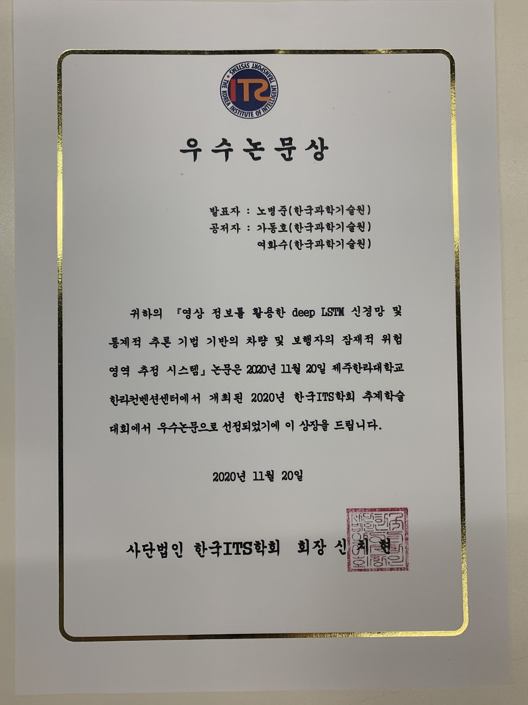

## [Dec. 15. 2021]  Speaker in 국민생활과학기술포럼
- 제43회 국민생활과학기술포럼: 이륜차 사고로부터의 국민안전 확보
- 주제: 사고예방을위한모빌리티빅데이터분석기술 및 방법 [Full video]

## [Apr. 24. 2021]  Interview with EBS in AIxMobility Lab 
- [EBS interview](../assets/images/promotion/ebs_snapshot.png)
- EBS 스마트도로, 미래로 가는길 [Full video] (https://www.ebs.co.kr/tv/show?prodId=6785&lectId=20496498)

## [Nov. 30. 2020]  Best paper award 

- Nov 2020, Fall conference in Jeju, Republic of Korea
- Title: "Vision-based predictive potential risky area estimation system for vehicle and pedestrian using deep LSTM network model and statistical inference"   
         (국문: 영상 정보를 활용한 deep LSTM 신경망 및 통계적 추론 기법 기반의 차량 및 보행자의 잠재적 위험 영역 추정 시스템)
